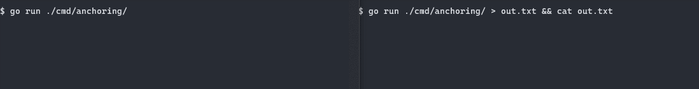

# frog

## Overview

Frog is a package for structured logging that is fast, easy to use, good looking, and customizable.

Frog includes:

- Built-in support for plain text or JSON output.
- Plain text output optinally supports ANSI colors per log level, including user-defined palettes.
  - Colors respect [NO_COLOR](https://no-color.org)
- [Anchoring](#anchoring) of log lines to the bottom of the terminal output for progress bars and real-time status updates.
- Detection of terminal/tty and disabling of ANSI/anchoring when none is found.
- User-customizable line rendering via the `Printer` interface.
- Nesting of Loggers to add fields, rendering settings, and custom behavior.
- Five log levels:

level | description
--- | ---
`Transient` | Output that is safe to ignore (like progress bars and estimated time remaining).
`Verbose` | Output for debugging (disabled by default).
`Info` | Normal events.
`Warning` | Unusual events.
`Error` | Something went wrong.

## Anchoring



Anchors require an ANSI-compatible terminal connected to the output.

To add an anchored Logger, call `frog.AddAnchor()` and pass in an existing Logger. If the Logger supports anchors, then it will return a new child Logger that targets the anchored line. If the Logger does not support anchored lines, `AddAnchor` will still return a valid Logger, possibly the same Logger that you passed in. Regardless, it is always safe to call `frog.RemoveAnchor()` on the returned Logger when you are done with it.

Note that you should not call `Close` on any Logger returned from `AddAnchor`. In fact, calling `Close` on any Logger besides the root Logger will panic. But the root Logger MUST have Close called on it, to ensure that any buffered log lines are flushed before your app terminates.

Note that anchor Loggers will only write to the anchored line when you use the Transient log level. Using Verbose, Info, Warning, or Error will pass through to the parent logger.

Note that the order you add anchored Loggers can be different from the order you remove them.

The above gif was created with this code:

```go
package main

import (
	"math/rand"
	"sync"
	"time"

	"github.com/danbrakeley/frog"
)

func main() {
	log := frog.New(frog.Auto)
	defer log.Close()

	log.Info("Spawning example threads...", frog.Int("count", 3))
	time.Sleep(time.Second)

	wg := new(sync.WaitGroup)
	wg.Add(3)
	for i := 0; i < 3; i++ {
		go doWork(wg, frog.AddAnchor(log), i)
	}

	time.Sleep(time.Second)
	log.Info("waited for one second...")
	time.Sleep(time.Second)
	log.Warning("waited for two seconds...")
	time.Sleep(time.Second)
	log.Error("BORED OF WAITING")
	wg.Wait()

	log.Info("All threads done!")
}

func doWork(wg *sync.WaitGroup, log frog.Logger, n int) {
	defer wg.Done()
	defer frog.RemoveAnchor(log)

	log.Transient(" + starting...", frog.Int("thread", n))
	time.Sleep(time.Duration(400*n) * time.Millisecond)

	for j := 0; j <= 100; j++ {
		log.Transient(" + Status", frog.Int("thread", n), frog.Int("percent", j))
		time.Sleep(time.Duration(10+rand.Intn(50)) * time.Millisecond)
	}
}
```

## Windows compatibility

Frog uses ANSI/VT-100 commands to change colors and move the cursor, and for this to display properly, you must be using Windows 10 build 1511 (circa 2016) or newer, or be using a third-party terminal application like ConEmu/Cmdr, mintty, or Windows Terminal. There's no planned supoprt for the native command prompts of earlier versions of Windows.

## Usage

The quickest way to get started is to create one of the default `Logger`s via a call to `frog.New`. The parameter `frog.Auto` tells `New` to autodetect if there's a terminal on stdout, and if so, to enable support for colors and anchored lines. There are other default styles you can pass to `New` as well, like `frog.Basic` and `frog.JSON`.

`frog.JSON` will output each log line as a single JSON object. This allows structured data to be easily consumed by a log parser that supports it (e.g. [filebeat](https://www.elastic.co/products/beats/filebeat)). A JSON logger created in this way doesn't support anchored lines, and by default will not output Transient level lines. Note that you can still call AddAnchor and Transient on such a logger, as the API remains consistent and valid, but nothing changes in the output as a result of these calls.

You can also build a custom Logger, if you prefer. See the implementation of the `New` function in [frog.go](https://github.com/danbrakeley/frog/blob/main/frog.go#L28-L55) for examples.

## TODO

- pass color palette instead of constant
- handle dicritics in uicode on long transient lines
- make some benchmarks, maybe do a pass on performance
- go doc pass
- test on linux and mac
- handle terminal width size changing while an app is running (for anchored lines)

## Known Issues

- A single log line will print out all given fields, even if multiple fields use the same name. When outputting JSON, this can result in a JSON object that has multiple fields with the same name. This is not necessarily considered invalid, but it can result in ambiguous behavior.
  - Frog will output the field names in the same order as they are passed to Log/Transient/Verbose/Info/Warning/Error (even when outputting JSON).
  - When there are parent/child relationships, the outermost parent adds their fields first, then the next outermost parent, etc.

## Release Notes

### latest

- **API BREAKING CHANGES**
- Changed frog.Palette from an enum to an array of frog.Color, which allows customizing colors used for each log level.
- TextPrinter no longer exports any of its fields, and instead users should use the printer options, e.g. POPalette(...)

### 0.9.0

- **API BREAKING CHANGES**
- `Logger` interface: removed `Log()`, added `LogImpl()`.
  - It is likely the signature of LogImpl will change in the near future.
- This is fallout from a large refactor to fix a bug when an `AnchoredLogger` wraps a `CustomizerLogger`
  - `Anchored` was written back when it was the only child logger, and it did dumb things like traverse up the parent chain until it found a Buffered, then set that as its parent (ignoring anything between it and the Buffered). Also it kept a copy of the Buffered's Printer.
  - Now all Loggers that wrap other loggers are expected to know their parent and pass through requests, making modifications as needed, until the request hits the root Logger. This is why LogImpl currently has the anchored line as a parameter. I hope to obfuscate this in the future.
- Added an extra Customizer to the relevant tests, so going forward this case will be tested.

### 0.8.4

- Handle anchored lines that are longer than the terminal width more gracefully
  - New behavior is that we detect the terminal width when frog comes up, then crops transient lines to that width
  - Can be manually set with printer option `POTransientLineLength(len)`

### 0.8.0

- Re-worked printer options to be algebraic data types (see printeroptions.go and printer.go)
- Allow overriding printer options per log line (see changes to the Printer's `Render` method and Logger's `Log` method).
- `frog.WithFields(parent, fields...)` allows creating a logger that is a pass-through to `parent`, but always adds the specified fields to each log line.
- `frog.WithPrinterOptions(parent, opts...)` allows creating a logger is a pass-through to `parent`, but always sets the specified PrinterOptions on each log line.
